# TryHackMe_Mr.Robot-CTF
<h3>TryHackMe Mr.Robot CTF Çözümü</h3>

1- Görev Tanımı: 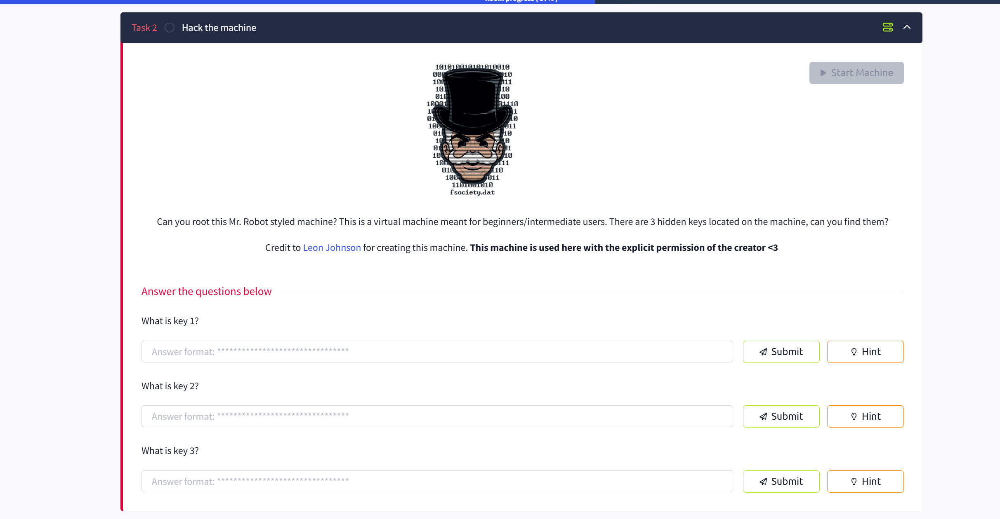  
2- Tanım: 3 adet anahtar bulmamız gerekiyor. Vpn konfigürasyonlarımızı yapıp "start machine" butonuna tıklayalım.  
Nmap Taraması: 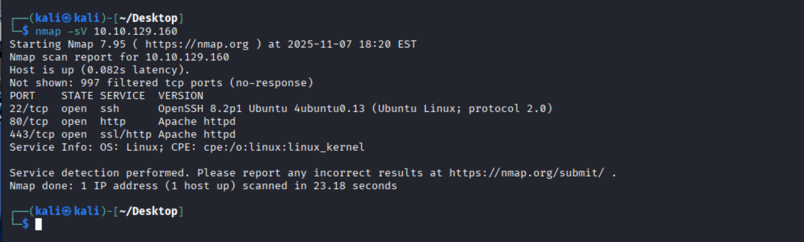  
3- Nmap taramamızı yapalım. Çıkan sonuçlara bakıldığında ssh, http, https portlarının açık olduğunu görüyoruz yani ekstrem bir durum yok.  
4- Web sitesini inceleyelim.  
Web Sitesi: 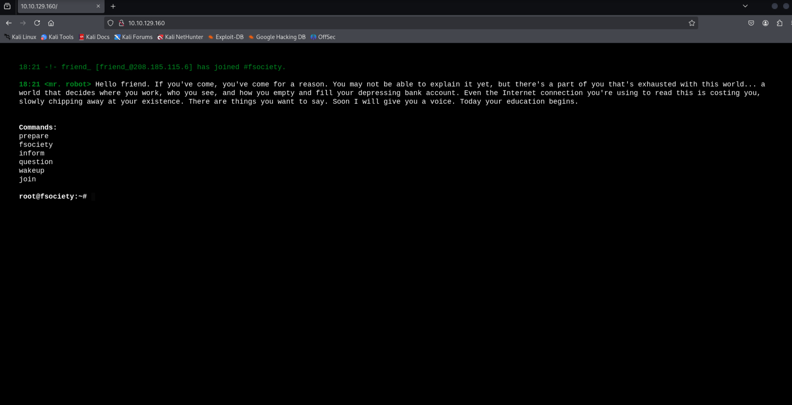  
5- Bu seçeneklere gidip bilgiler edinebilirsiniz. Diziye yönelik kareler ve videolar var yine de göz atmanızı öneririm.  
Robots: 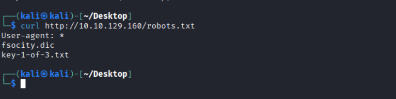  
6- Robots.txt dosyasına curl ile eriştiğimizde anahtarlarımızdan ilki olan "key-1-of-3.txt" dosyasını görüyoruz. Bunu cat ile okuyalım.  
Anahtar 1: 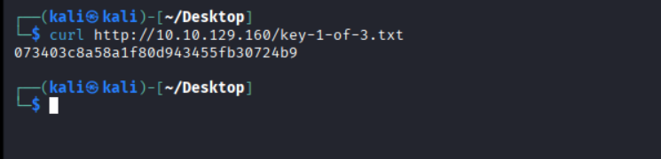  
7- İlk anahtarımızı bulduk. "073403c8a58a1f80d943455fb30724b9"  
8- Dikkat etmemiz gereken bir dosya daha var: "fsociety.dic". Bu dosya wordlist'tir. Bu da demek oluyor ki bir yerlerde brute force(kaba kuvvet saldırısı) yapacağız. Bu dosyayı kali'mize indirmemizde fayda var. Hemen indirelim  
Wordlist İndirme: 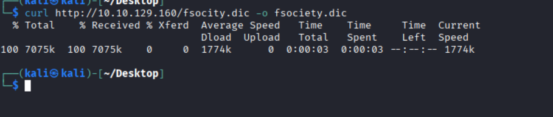  
9- curl http://10.10.129.160/fsocity.dic -o fsociety.dic komutuyla dosyamızı indirelim.  
fsociety dosya içeriği: 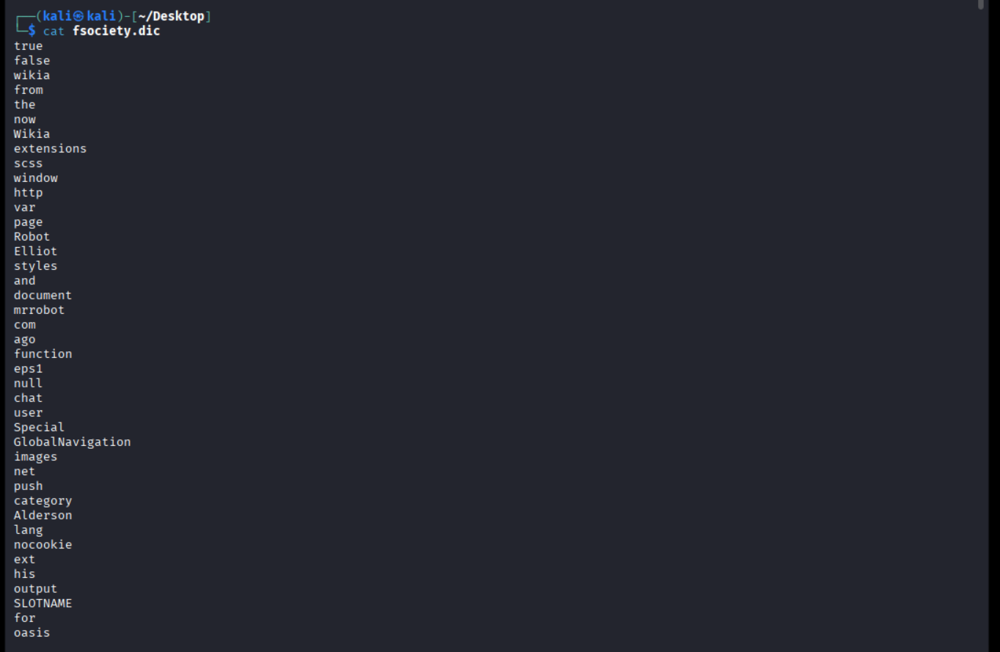  
10- cat komutu ile okuduğumuzda wordlistimizi görüyoruz. Bu dosya kenarda dursun biz dizin taramasıyla devam edelim.  
Dizin Taraması: 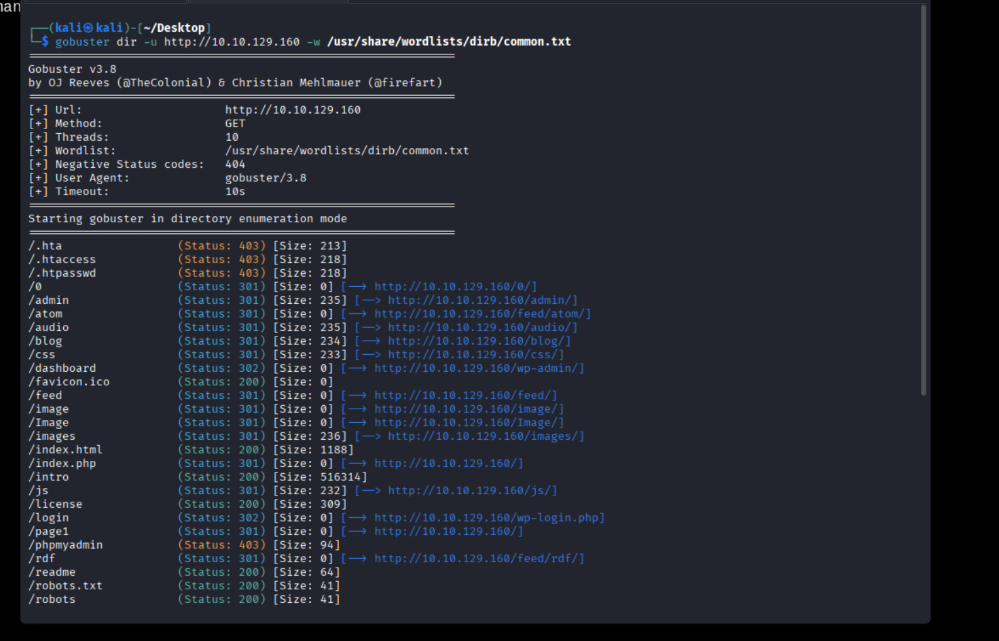  
11- gobuster dir -u http://10.10.129.160 -w /usr/share/wordlists/dirb/common.txt komutuyla dizin taraması yapalım.  
12- Çıktıda, birçok wp- ile başlayan dizin/dosya görüyoruz. Bu, sitenin bir WordPress olduğunu kesinleştiriyor. Özellikle dikkat etmemiz gerekenler: /dashboard (Status: 302) $\rightarrow$ /wp-admin/ adresine yönlendiriyor. /login (Status: 302) $\rightarrow$ /wp-login.php adresine yönlendiriyor. /wp-login (Status: 200) $\rightarrow$ giriş sayfasını doğrudan gösteriyor. Bir sonraki adım, WordPress kurulumuna sızmak ve ikinci anahtarımızı bulmak için bir kullanıcı adı ve şifre elde etmek ki bunu da brute force ile halledeceğiz.  
WPScan: 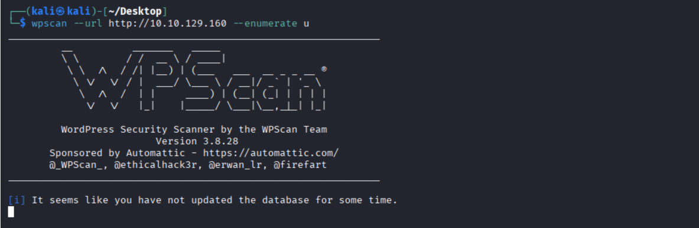  
13- WordPress'te kullanıcı adlarını bulmak için genellikle WPScan aracını kullanırız. WPScan; kullanıcı adlarını, savunmasız eklentileri ve temaları bulmada çok etkilidir.  
14- wpscan --url http://10.10.129.160 --enumerate u komutuyla WPScan taraması başlatalım.  
<b>NOT:<b> ip bölümlerine lütfen CTF'inizin ip'sini yazın.  
15- WPScan çıktısına baktığımızda "elliot" isimli bir kullanıcı adı görüyoruz. Şaşırmadık tabii, diziyi izlediyseniz tahmin etmesi zor değil :)  
WordPress: 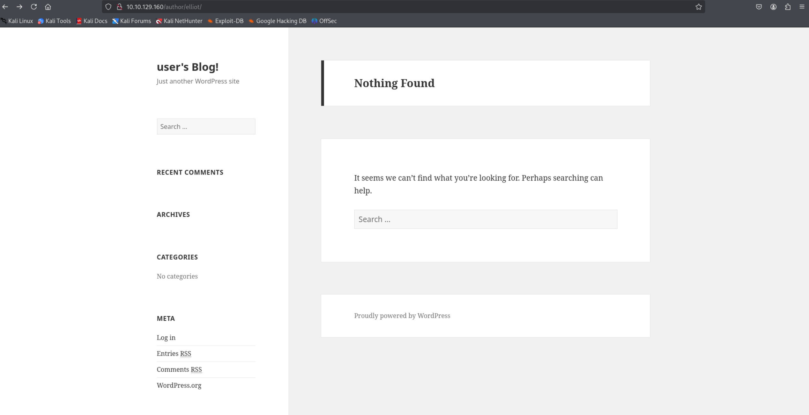  

16- http://10.10.129.160/author/elliot/ URL'ine gidelim. Bu, WordPress'in yazar ID'si 1 olan kullanıcının adının elliot olduğunu onayladığı anlamına gelir. Şimdi brute force kısmına geçebiliriz ama geçmeden önce fsociety.dic dosyamızın içeriğine dikkat ettiyseniz çok fazla tekrarlanan kelimeler var. Bunu sade hale getirelim.  
17- cat fsociety.dic | sort -u > unique_fsociety.dic komutuyla dosyamızda tekrar eden kelimeleri çıkaralım.  
Brute Force: 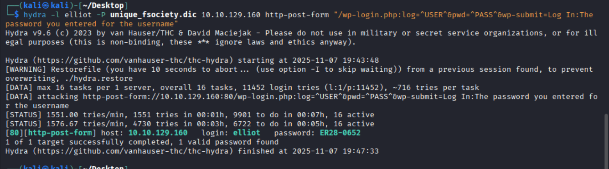  
18- hydra -l elliot -P unique_fsociety.dic 10.10.129.160 http-post-form "/wp-login.php:log=^USER^&pwd=^PASS^&wp-submit=Log In:The password you entered for the username" komutuyla brute force işlemini gerçekleştirelim. WPScan kullanmak isterseniz eğer: wpscan --url http://10.10.129.160 --usernames elliot --passwords fsociety.dic  
19- "[80][http-post-form] host: 10.10.129.160   login: elliot   password: ER28-0652" şu çıktıya dikkat edersek, parolayı kırdığımızı göreceksiniz. WordPress'e bu bilgilerle giriş yapalım. Daha önce bulduğumuz http://10.10.129.160/wp-login.php URL'ine gidelim.  
Port Dinleme: 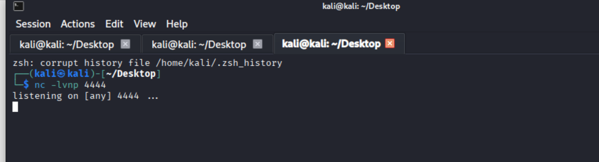  
20- nc -nvlp 4444 ile 4444 portunu dinleyelim. Bu terminal sekmesi dursun, kapatmayın lütfen.  
WP Admin: 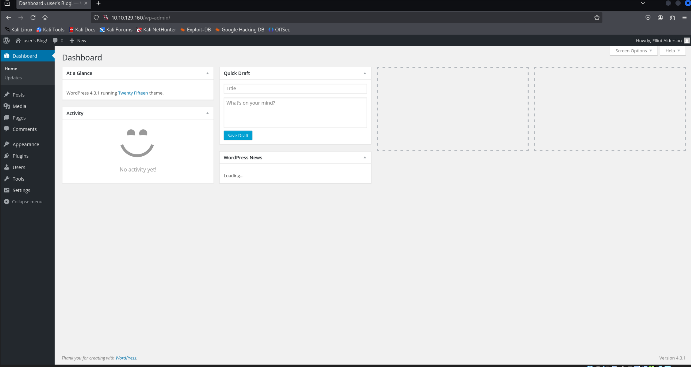  
21- WP paneline giriş yaptık. Panele girdikten sonra, sol menüden Görünüm (Appearance) $\rightarrow$ Tema Düzenleyici (Theme Editor)'ye gidin.  
Template: 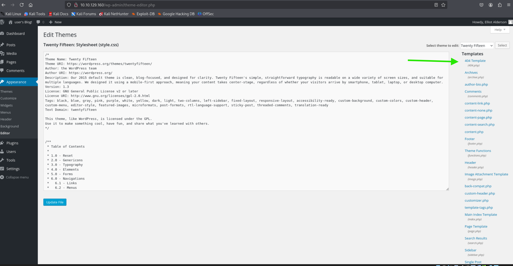  
22- Yeşil ok ile gösterdiğim "404 template" seçeneğine tıklayıp dosyadaki tüm mevcut kodu silin ve yerine, kendi IP adresiniz ve portunuz ile özelleştirilmiş bir php reverse shell Kodu yapıştırın. <b>Kodlara wp_payload.txt dosyasından ulaşabilirsiniz.</b>  
Kod: 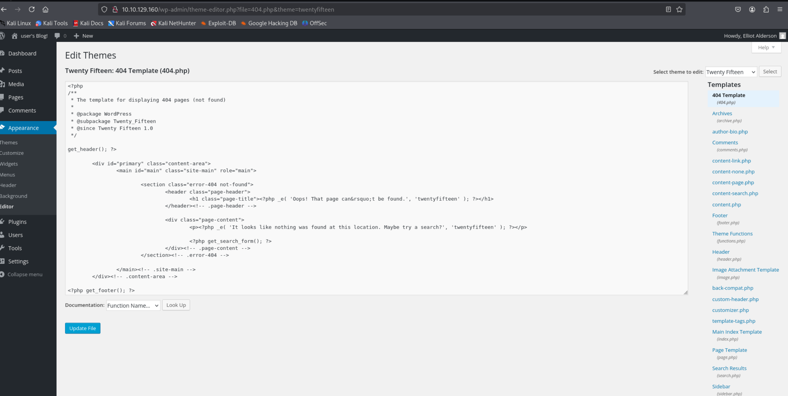  
23- Kodlarımızı yazıp "Update" butonuna tıkladıktan sonra payload'umuzu tetiklemek için http://10.10.129.160/wp-content/themes/twentyfifteen/404.php adresine gidin.   
Shell: 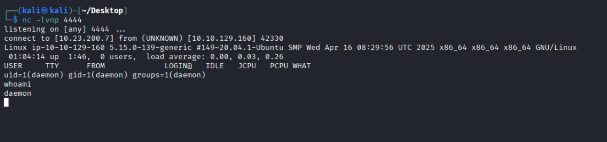  
24- Terminalimize baktığımızda reverse shell bağlantımızın kurulduğunu göreceksiniz.  
25- python -c 'import pty; pty.spawn("/bin/bash")' komutuyla kabuğumuzu geliştirelim.  
Komut: 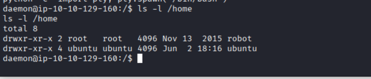  
Komut:   
26- "key-2-of-3.txt" dosyasını okuyamıyoruz çünkü yetkimiz yok. Kullanıcı değiştirmemiz gerekiyor.  
27- password.raw-md5: Bu, robot kullanıcısına geçiş yapmak için ihtiyacımız olan bir ipucudur. Dosyanın okuma yetkisi var (-rw-r--r--) yani daemon kullanıcısı olarak bu dosyayı okuyabiliriz.  
Cat: 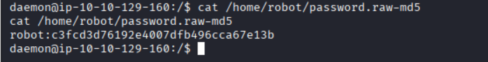  
28- password.raw-md5 dosyasının içeriği: c3fcd3d76192e4007dfb496cca67e13b ve bu, robot kullanıcısının parolasına ait MD5 hash'idir.  
29- Elde ettiğimiz hash'i online toollar ile text haline getirelim. Google'a "MD5 decode" yazıp herhangi bir siteye gidip decode edelim.  
Decode: 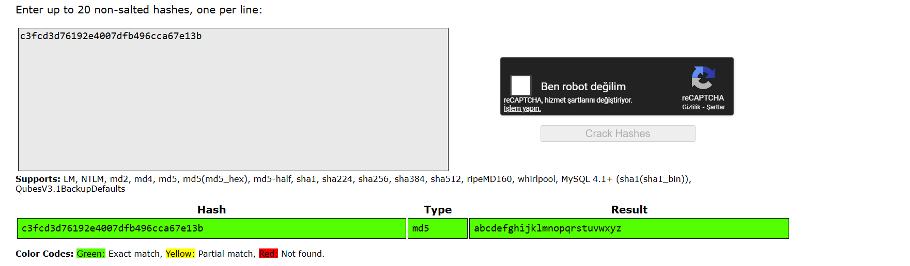  
30- Decode ettiğimizde: "abcdefghijklmnopqrstuvwxyz" text'ini alırız.  
Kullanıcı Değişimi: 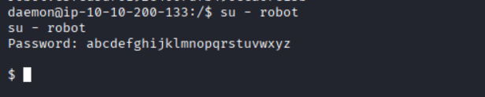  
31- su - robot komutunu yazıp parolaya da "abcdefghijklmnopqrstuvwxyz" yazıp kullanıcı değiştirelim. "whoami" yazarak test edebilirsiniz.  
Anahtar 2: 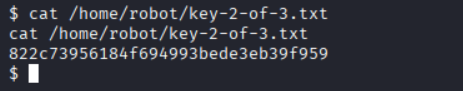  
32- Tebrikler, artık ikinci anahtarı ("822c73956184f694993bede3eb39f959") okuyabiliyoruz. Devam edelim
Zafiyet: 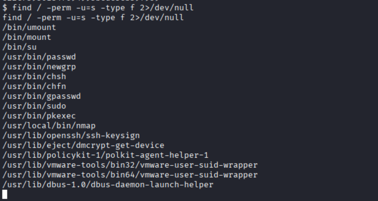  
33- find / -perm -u=s -type f 2>/dev/null komutuyla sistemde, kullanıcıların normalde root yetkisiyle çalıştırılması gereken programları kendi yetkileriyle çalıştırmasına izin veren SUID (Set User ID) bit'i ayarlanmış dosyaları arayalım. Bu, yetki yükseltme için en yaygın yoldur.
34- Listeye baktığımızda önemli bir çıktıyı göreceğiz: /usr/local/bin/nmap
Nmap: 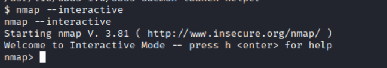  
35- nmap --interactive komutunu yazarak nmap'in kendi komut istemine düşelim.  
Root: 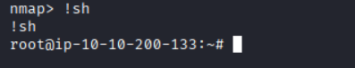  
36- !sh komutunu yazarak zafiyetten yararlanalım. Nmap isteminde, bir kabuk çalıştırmasını talep etmelisin. SUID bit'i ayarlı olduğu için bu kabuk root yetkisine sahip olacaktır. Artık Root kullanıcısıyız  
Anahtar 3: 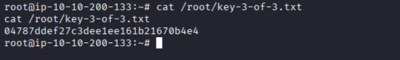  
37- Üçüncü anahtarımızı ("04787ddef27c3dee1ee161b21670b4e4") bulduk.  
<b>Okuduğunuz için teşekkür ederim.</b> 
<b>https://www.linkedin.com/in/albora-dogan-deniz-4a56a21b8/</b>
